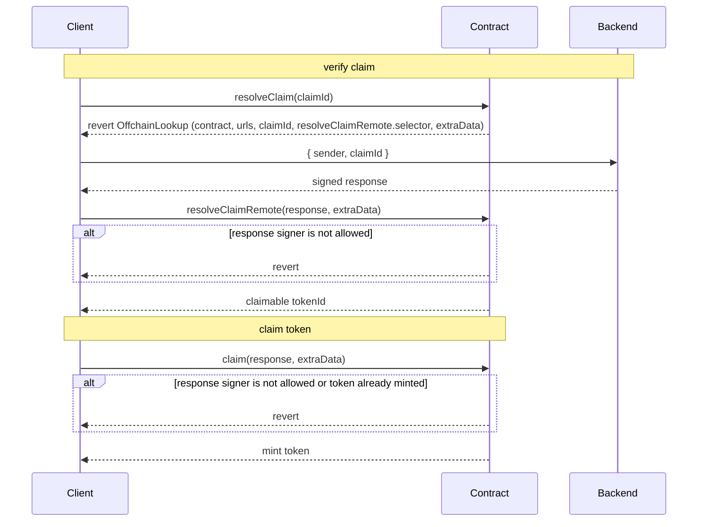

This is a sample contract that utilizes [ERC-3668](https://eips.ethereum.org/EIPS/eip-3668) to retrieve data from an off-chain source.

The project comprises a backend that validates a claim and generates a unique `tokenId`. The contract returns the `tokenId` for a claim and, if desired, mints an NFT in a single transaction.

```shell
yarn test
npx hardhat run scripts/deploy.ts --network goerli
npx hardhat verify --network goerli <address> --contract contracts/NFT.sol:NFT
```

* Tests: `test/NFT.ts` 
* Example CCIP Reading process: `example/ethers-call.js`
* Contract: `contracts/NFT.sol`
* Cloudflare-Worker of the HTTP Resolver: `server-worker/src/worker.ts`



- Example Deployment: [`0xBf159FBA384CA8CD4888C82cDd264ce1a16aDE46`](https://goerli.etherscan.io/address/0xBf159FBA384CA8CD4888C82cDd264ce1a16aDE46)
- Worker: https://server-worker.cloudflare3563.workers.dev